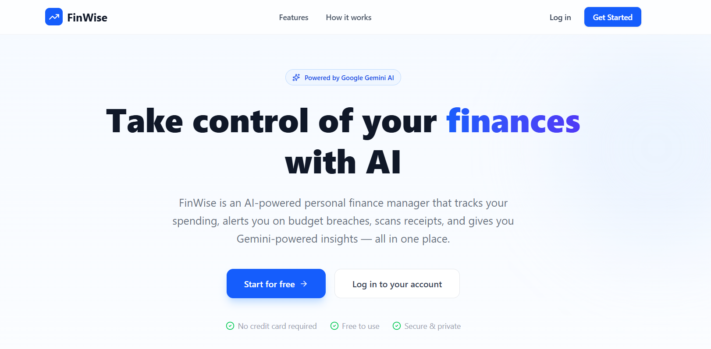
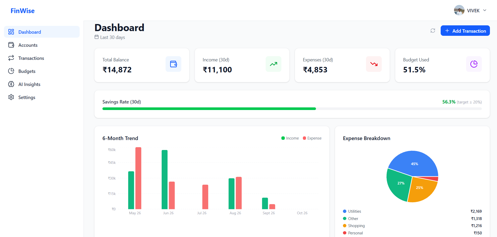
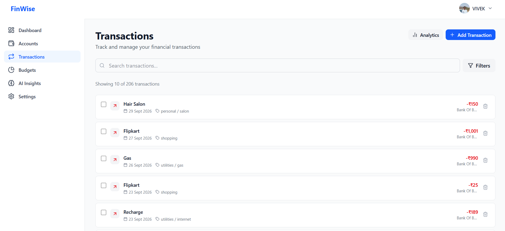
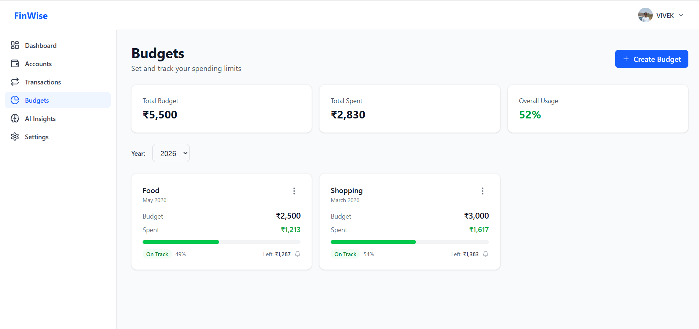
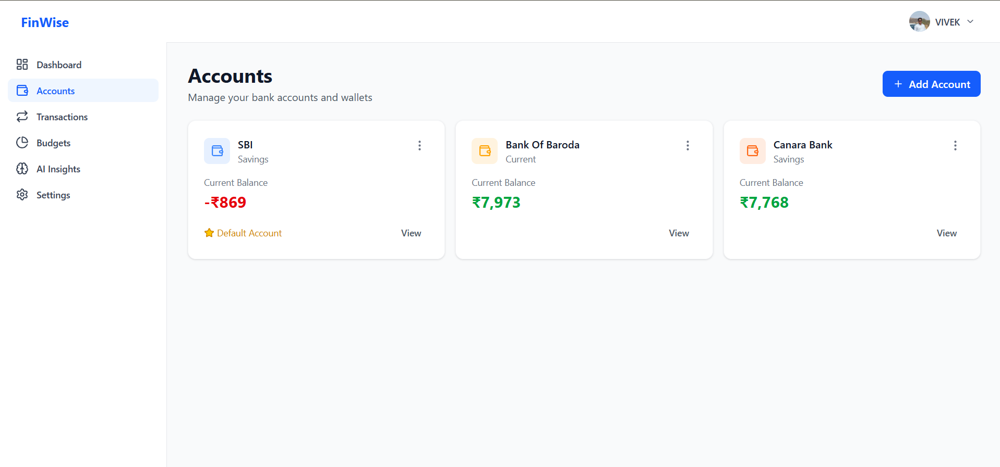
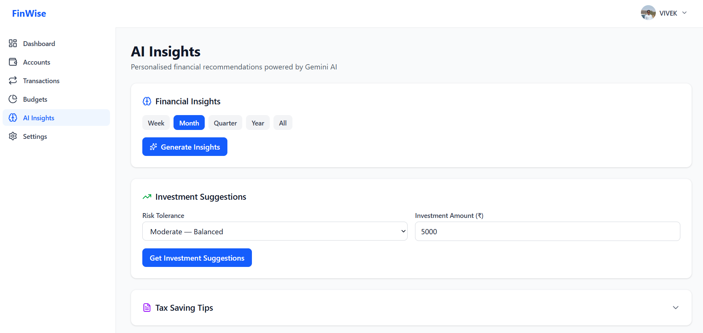

<div align="center">

<!--  -->

# FinWise

**AI-Powered Personal Finance Web App**

[](https://finwise-personal-finance.vercel.app/)
[](https://react.dev/)
[](https://nodejs.org/)
[](https://www.mongodb.com/)
[](https://ai.google.dev/)

*Final-year B.Tech Capstone Project — Sanjay Ghodawat University, Kolhapur*

</div>

---

## What is FinWise?

FinWise is a full-stack personal finance application that helps users track income and expenses, manage category budgets, and get AI-driven financial insights — all in one place. Built as a final-year capstone, it covers a realistic production architecture: JWT auth, protected REST APIs, real-time alerts, Gemini AI integration, and a responsive React dashboard.

> **Live:** [finwise-personal-finance.vercel.app](https://finwise-personal-finance.vercel.app/)

---

## Features

| Module | What it does |
|---|---|
| **Authentication** | JWT-based register/login, bcrypt password hashing, protected routes |
| **Dashboard** | Overview of income, expenses, savings, and spending trends via Recharts |
| **Transactions** | Add, edit, delete income/expense entries with category tagging |
| **Budget Manager** | Set monthly/yearly budgets per category; upsert logic prevents duplicates |
| **Budget Alerts** | Auto-triggers warnings at configurable thresholds (e.g., 80% spent) |
| **Accounts** | Manage multiple financial accounts; filter transactions by account |
| **AI Advisor** | Gemini AI-powered chat for personalized financial advice |
| **Notifications** | In-app + email notifications via Nodemailer |
| **Profile & Settings** | User profile management, avatar upload via Cloudinary |

---

## Tech Stack

### Frontend
- **React 19** + **Vite 7**
- **TailwindCSS 4** for styling
- **TanStack Query (React Query v5)** for server state + caching
- **React Hook Form** + **Zod** for form validation
- **Recharts** for data visualization
- **React Router v7**
- **Sonner** for toast notifications
- **Lucide React** for icons

### Backend
- **Node.js** + **Express 5**
- **MongoDB** + **Mongoose 8**
- **JWT** + **bcryptjs** for auth
- **Google Gemini AI** (`@google/genai`) for AI features
- **Helmet** + **express-rate-limit** for security
- **Cloudinary** for image uploads
- **Nodemailer** + **Twilio** for notifications
- **Socket.io** for real-time updates
- **node-cron** for scheduled jobs

---

## API Reference

All routes are prefixed with `/api`. Protected routes require `Authorization: Bearer <token>`.

### Auth
| Method | Endpoint | Description |
|---|---|---|
| POST | `/auth/register` | Register new user |
| POST | `/auth/login` | Login, returns JWT |
| GET | `/auth/me` | Get current user (protected) |

### Budgets
| Method | Endpoint | Description |
|---|---|---|
| GET | `/budgets?year=2025` | Get all budgets with current spending |
| GET | `/budgets/current` | Current month budget + expenses |
| GET | `/budgets/alerts` | Active budget alerts for current month |
| GET | `/budgets/stats?year=2025` | Budget stats by category |
| POST | `/budgets` | Create or update budget (upsert) |
| PUT | `/budgets/:id` | Update budget by ID |
| DELETE | `/budgets/:id` | Delete budget |

### Transactions
| Method | Endpoint | Description |
|---|---|---|
| GET | `/transactions` | Get all transactions (paginated, filterable) |
| POST | `/transactions` | Create transaction |
| PUT | `/transactions/:id` | Update transaction |
| DELETE | `/transactions/:id` | Delete transaction |

### AI
| Method | Endpoint | Description |
|---|---|---|
| POST | `/ai/insights` | Gemini AI advisor |

---

## Getting Started

### Prerequisites
- Node.js 18+
- MongoDB (Atlas)
- Google Gemini API key
- Cloudinary account (for image uploads)

### 1. Clone the repo
```bash
git clone https://github.com/vivekrokadi/FinWise.git
cd FinWise
```

### 2. Backend Setup
```bash
cd FinWise-Backend
npm install
```

Create a `.env` file in `FinWise-Backend/`:
```env
PORT=5000
MONGO_URI=your_mongodb_connection_string
JWT_SECRET=your_jwt_secret
JWT_EXPIRE=30d
CLIENT_URL=http://localhost:5173

# Google Gemini AI
GEMINI_API_KEY=your_gemini_api_key

# Cloudinary
CLOUDINARY_CLOUD_NAME=your_cloud_name
CLOUDINARY_API_KEY=your_api_key
CLOUDINARY_API_SECRET=your_api_secret

# Email (Nodemailer)
EMAIL_HOST=smtp.gmail.com
EMAIL_PORT=587
EMAIL_USER=your_email
EMAIL_PASS=your_email_password

NODE_ENV=development
```

```bash
npm run dev       # starts with nodemon on port 5000
npm run seed      # optional: seed sample data
```

### 3. Frontend Setup
```bash
cd ../FinWise-Frontend
npm install
```

Create a `.env` file in `FinWise-Frontend/`:
```env
VITE_API_URL=http://localhost:5000/api
```

```bash
npm run dev       # starts Vite dev server on port 5173
```

### 4. Open the app
Visit `http://localhost:5173`

---

## Environment Variables Summary

| Variable | Where | Required |
|---|---|---|
| `MONGO_URI` | Backend | ✅ |
| `JWT_SECRET` | Backend | ✅ |
| `GEMINI_API_KEY` | Backend | ✅ |
| `CLOUDINARY_*` | Backend | For image uploads |
| `EMAIL_*` | Backend | For email notifications |
| `VITE_API_URL` | Frontend | ✅ |

---

## Screenshots


<div align="center">
  
  
  
  
  
  
</div>


<div align="center">

Built with React, Node.js, MongoDB, and Google Gemini AI

</div>